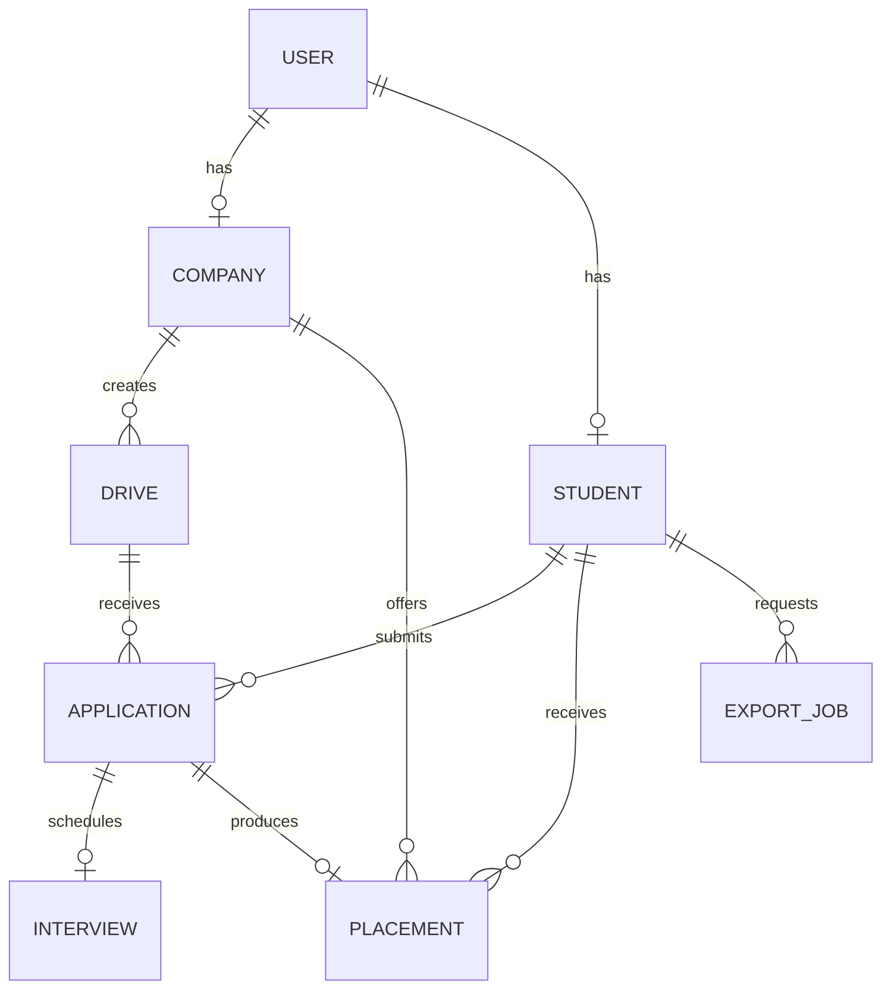

# Placement Portal Application V2

This project is being developed as part of the Modern Application Development II course in the IIT Madras BS Degree programme.

The Placement Portal Application allows Admin, Companies, and Students to manage placement drives, job applications, student applications, and placement-related activities.

## Technology Stack

Flask
Vue.js
Bootstrap
SQLite
Redis
Celery

## User Roles

Admin
Company
Student

## Project Status

All eight core milestones are implemented.

## Setup and Run

### 1. Backend

```bash
python3 -m venv .venv
source .venv/bin/activate
pip install -r backend/requirements.txt
cd backend
python init_db.py
python app.py
```

`init_db.py` asks for the predefined admin email and password. The database is created by SQLAlchemy code, not manually.

### 2. Frontend

Open another terminal:

```bash
cd frontend
npm install
npm run dev
```

Open `http://localhost:5173`.

### 3. Redis and Celery

Start Redis, then use two terminals inside `backend` with the virtual environment active:

```bash
celery -A tasks.celery worker --loglevel=info
celery -A tasks.celery beat --loglevel=info
```

SMTP settings are optional environment variables: `MAIL_SERVER`, `MAIL_PORT`, `MAIL_USERNAME`, `MAIL_PASSWORD`, and `MAIL_SENDER`. Without them, development emails/reports are saved locally inside ignored folders.

## Testing

```bash
.venv/bin/python -m unittest discover -s backend/tests -v
npm --prefix frontend run build
```

## Main API Groups

- `/api/auth`: registration, login, logout and current user
- `/api/admin`: statistics, approvals, search and account management
- `/api/company`: profile, drives, applicants, status and interviews
- `/api/student`: profile, drive search, applications, history and CSV export

## Database ER Diagram



## Milestone Notes

- [Milestone 1 - Database Models and Schema](docs/milestone-1.md)
- [Milestone 2 - Authentication and RBAC](docs/milestone-2.md)
- [Milestone 3 - Admin Dashboard and Management](docs/milestone-3.md)
- [Milestone 4 - Company Dashboard and Job Management](docs/milestone-4.md)
- [Milestone 5 - Student Dashboard and Applications](docs/milestone-5.md)
- [Milestone 6 - History and Status Tracking](docs/milestone-6.md)
- [Milestone 7 - Celery Jobs and CSV Export](docs/milestone-7.md)
- [Milestone 8 - Redis Caching](docs/milestone-8.md)
- [Quick Viva Guide](docs/viva-guide.md)

## Student Details

- Student ID: 23f2000465
- Course: Modern Application Development II
- Project: Placement Portal Application V2
