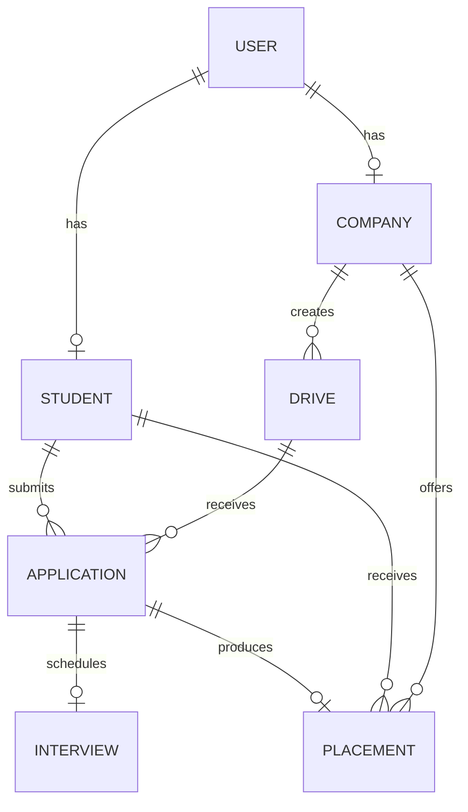

# Placement Portal Application V2

This project is being developed as part of the Modern Application Development II course in the IIT Madras BS Degree programme.

The Placement Portal Application allows Admin, Companies, and Students to manage placement drives, job applications, student applications, and placement-related activities.

## Technology Stack

Flask
Vue.js
Bootstrap
SQLite
Redis
Celery

## User Roles

Admin
Company
Student

## Project Status

Milestone 0: GitHub repository setup completed.

## Database ER Diagram

## Milestone Notes

- [Milestone 1 - Database Models and Schema](docs/milestone-1.md)
- [Milestone 2 - Authentication and RBAC](docs/milestone-2.md)

## Student Details

- Student ID: 23f2000465
- Course: Modern Application Development II
- Project: Placement Portal Application V2
